# E-commerce Sales Analysis using SQL + Python

## Overview

This project analyzes an e-commerce dataset using MySQL, Python, Pandas, Matplotlib, and Seaborn. It includes CSV-to-SQL ETL and end-to-end business analysis queries from basic to advanced levels.

## Project Structure

* `Problem Statement.pdf`
* `csv_to_sql.ipynb`
* `Sales_Analysis.ipynb`

## Features

* Import multiple CSV files into MySQL tables
* Run 15+ SQL analytics queries
* Create charts and summary tables
* Window functions, ranking, moving averages, YoY growth, retention analysis

## Dataset Tables

* customers
* geolocation
* orders
* order_items
* products
* sellers
* payments
* reviews (if available)

## Setup

```bash
pip install pandas mysql-connector-python matplotlib seaborn
```

## Database Connection

Update credentials in notebook:

```python
db = mysql.connector.connect(host='hostname', username='username', password='db-password', database='database_name')
```

## Workflow

1. Load CSV files
2. Create MySQL tables
3. Insert records
4. Execute SQL queries
5. Visualize insights

## SQL Business Analysis

### Basic Queries

1. Find all distinct cities where customers are located.


2. Count total number of orders placed in the year 2017.


3. Calculate revenue generated by each product category.

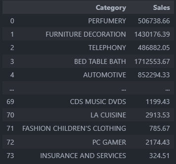

4. Find percentage of orders paid through installments.

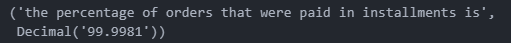

5. Count customers grouped by state.

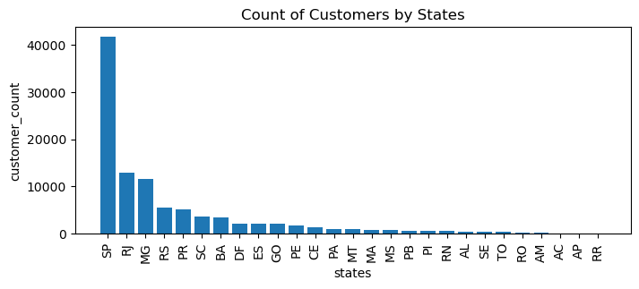

### Intermediate Queries

6. Count monthly orders placed in 2018.

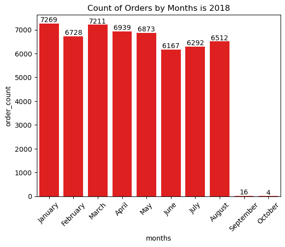

7. Calculate average number of products per order for each city.

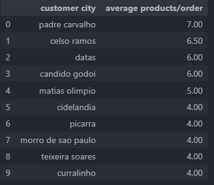

8. Calculate percentage contribution of each category to total revenue.

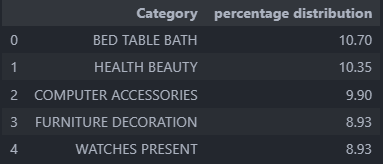

9. Analyze relationship between product price and purchase count.


10. Rank sellers based on total revenue generated.

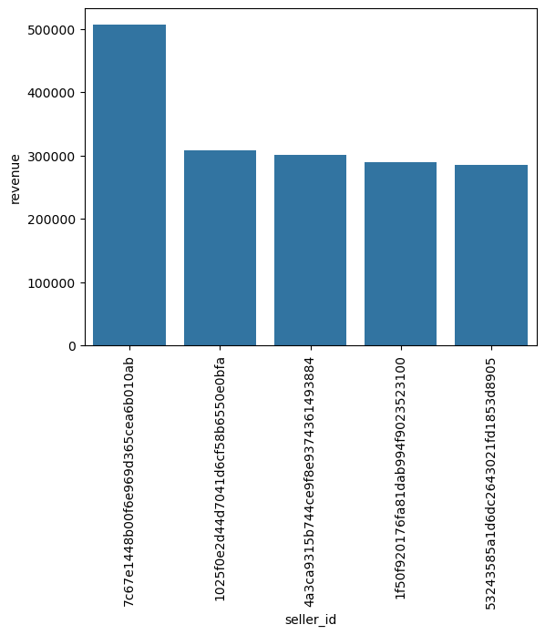

### Advanced Queries

11. Calculate moving average of order values over customer history.

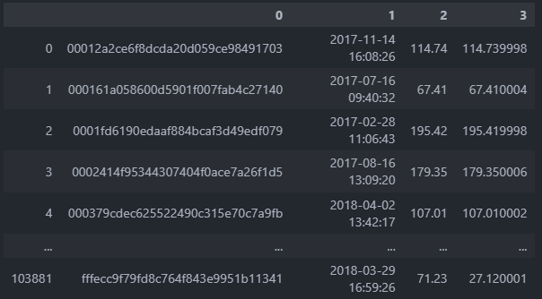

12. Compute running total of sales month by month.

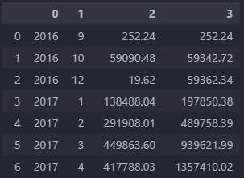

13. Measure year-over-year sales growth percentage.

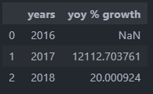

14. Find percentage of customers purchasing again within 6 months.


15. Identify top 3 highest spending customers each year.

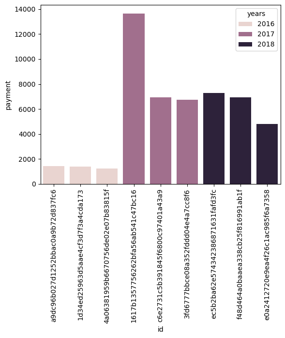
